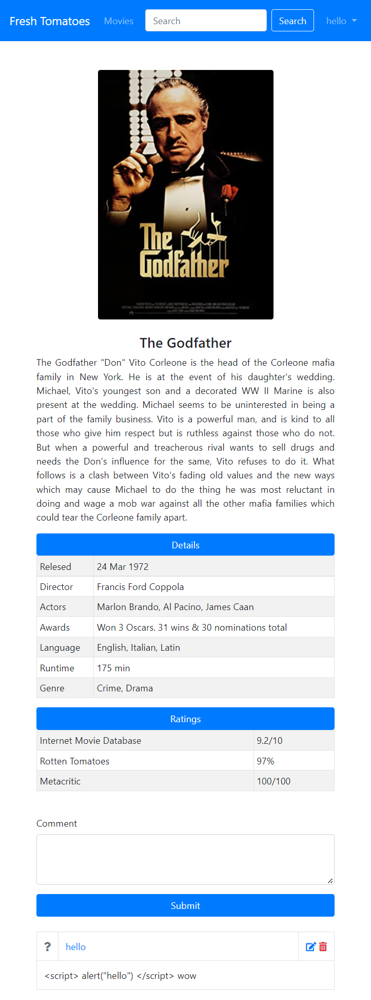
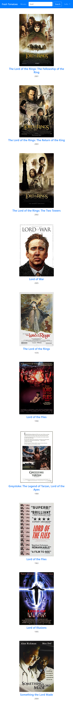
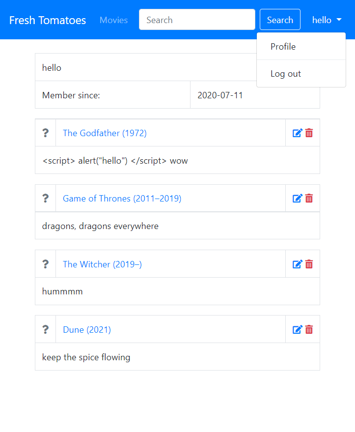
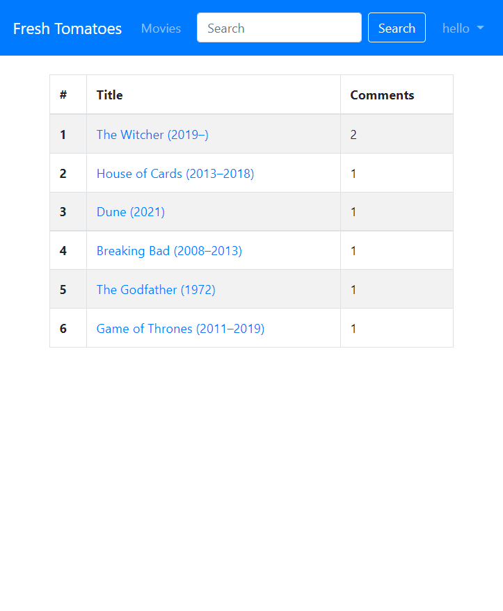

# as_ive_seen_it

Simple node.js express app, where users can check movie related information, and discuss their favourite movies.
Movie posters and other data: http://www.omdbapi.com/

 ## Screenshots:
 

movie details

search

user profile

movies with comments

